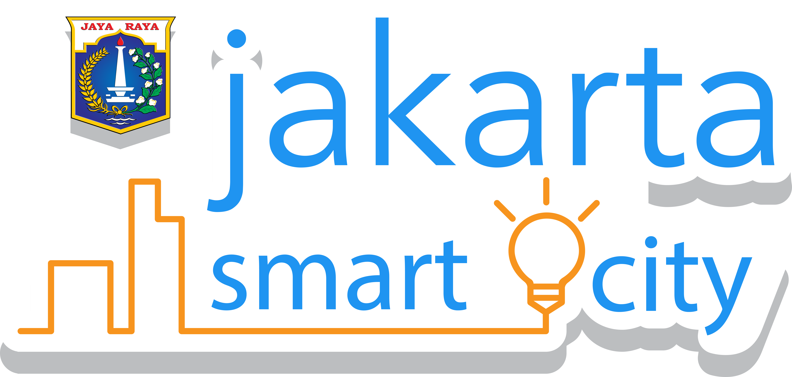

# Introduction

PetaBencana.id is a project initiated by the Urban Risk Lab at MIT as a free, transparent platform for emergency response and disaster management in megacities in South and Southeast Asia.

The platform adopts a “people as sensors” paradigm, where confirmed reports are collected directly from the users at street level in a manner that removes expensive and time-consuming data processing. This framework creates accurate, real-time data which is immediately made available for users and first responders.

PetaBencana.id gathers, sorts, and visualizes data using specially developed CogniCity Open Source Software - an enterprise-level platform for emergency response and disaster management - to transforms the noise of social and digital media into critical information for residents, communities, and government agencies

## Petabencana Data API

Petabencana is backed by a data [API](https://en.wikipedia.org/wiki/Application_programming_interface) exposing a number of public and private endpoints. The documentation that follows allows developers to get up and running. The project is fully open source and the code is available in the [PetaBencana GitHub](https://github.com/petabencana/). The architectural diagram is available in different formats:

* [PDF](https://github.com/petabencana/petabencana-docs/tree/d8b3cac5b3bc2a65abd49d874bf9c5798e93eb97/petabencana.pdf)
* [Visio XML](https://github.com/petabencana/petabencana-docs/tree/d8b3cac5b3bc2a65abd49d874bf9c5798e93eb97/petabencana.vdx)
* [OmniGraffle](https://github.com/petabencana/petabencana-docs/tree/d8b3cac5b3bc2a65abd49d874bf9c5798e93eb97/petabencana.graffle.zip)

### Our Sponsors

#### Funding partners

 

#### Sustaining Partners

#### Data Partners

#### Implementing Partners

#### Project Partners

  

